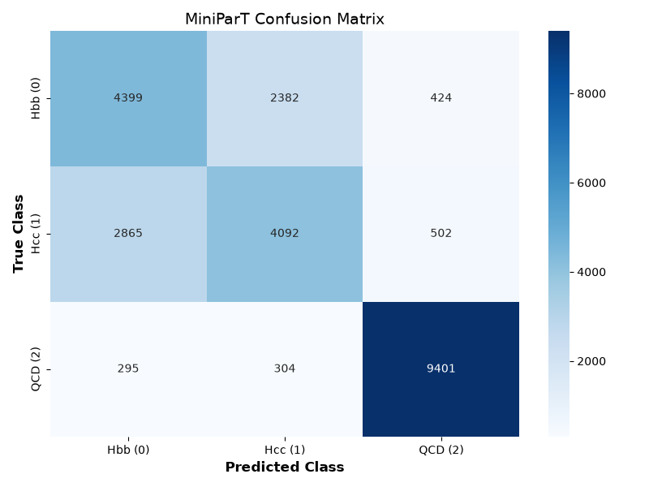
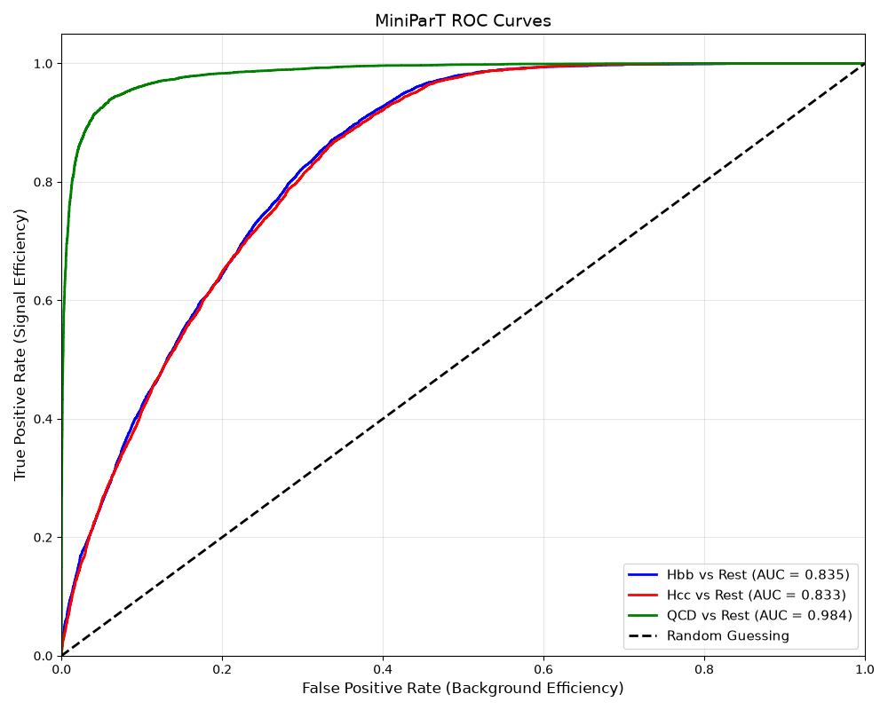

# MiniParT — A Tiny Particle Transformer

This repo builds, from scratch, a very small AI model that looks at particle
collisions from the CMS experiment at CERN and guesses **what made them**.

Specifically, it looks at pairs of "jets" (sprays of particles) and decides
between three options:

1. **Hbb** — the jets came from a Higgs boson that decayed into two bottom quarks
2. **Hcc** — the jets came from a Higgs boson that decayed into two charm quarks
3. **QCD** — the jets are just random background noise, not from a Higgs boson at all

Telling Hbb and Hcc apart is a genuinely hard physics problem — b-quarks and
c-quarks leave very similar footprints in a detector. That's exactly why it's
a good teaching example: it's simple enough to build in an afternoon, but
real enough that the same ideas scale up to the actual particle-physics AI
models (like the full [Particle Transformer](https://arxiv.org/abs/2202.03772)).

**MiniParT is a mini version of that: same core idea (a transformer looking
at jets), radically simplified so a human can read every line and understand
every variable.**

## Start here

Don't jump into the code first. Read the lessons in order — each one explains
the *why* before you see the *how*. They're written so a curious middle
schooler could follow them, but they don't skip anything a real ML engineer
needs to know.

| # | Lesson | What you'll learn |
|---|--------|--------------------|
| 0 | [The Big Picture](lessons/00_big_picture.md) | What problem we're solving and why |
| 1 | [What Is a Jet?](lessons/01_what_is_a_jet.md) | The 10 numbers that describe each jet |
| 2 | [Finding the Truth Labels](lessons/02_finding_the_truth_labels.md) | How we know which jets are "real" Hbb/Hcc jets |
| 3 | [Preparing the Data](lessons/03_preparing_the_data.md) | Splitting, scaling, batching |
| 4 | [Building MiniParT](lessons/04_building_mini_part.md) | The model itself, piece by piece |
| 5 | [Training the Model](lessons/05_training_the_model.md) | How the model actually learns |
| 6 | [Evaluating the Model](lessons/06_evaluating_the_model.md) | Did it work? How do we know? |

Each lesson ends with a "Quick recap" and links to the matching code file in
[`code/`](code/), which you can run for real.

## Repo structure

```
mini_model_parT/
├── README.md                       <- you are here
├── requirements.txt                 <- Python packages you need
├── datasets/
│   └── README.md                   <- where to get the CERN data, not the data itself
├── lessons/
│   ├── 00_big_picture.md
│   ├── 01_what_is_a_jet.md
│   ├── 02_finding_the_truth_labels.md
│   ├── 03_preparing_the_data.md
│   ├── 04_building_mini_part.md
│   ├── 05_training_the_model.md
│   └── 06_evaluating_the_model.md
└── code/
    ├── features.py                 <- reads raw CERN files, matches jets to truth-level Higgs daughters
    ├── prepare_data.py             <- split / scale / batch
    ├── model.py                    <- the MiniParT class
    ├── train.py                    <- the training loop
    ├── evaluate.py                 <- accuracy, confusion matrix, ROC curves
    └── run_all.py                  <- runs the whole pipeline end to end
```

## The data

This project uses real CMS Open Data, released publicly by CERN under a
CC0 (public domain) license:

- `ttHTobb.root` — [CERN Open Data record 67645](https://opendata.cern.ch/record/67645)
- `ttHTocc.root` — [CERN Open Data record 67651](https://opendata.cern.ch/record/67651)
- `qcd_bctoe.root` — [CERN Open Data record 63242](https://opendata.cern.ch/record/63242)

See [`datasets/README.md`](datasets/README.md) for how to download them. The
files themselves are gigabytes in size, so they are **not** stored in this
repo — only instructions for getting them.

## Quick start (once you have the data)

```bash
pip install -r requirements.txt
python code/run_all.py
```

This trains MiniParT on your machine and prints accuracy, a confusion
matrix, and ROC curves at the end.

## Results

A full run of `python code/run_all.py` (10 epochs) reaches:

**Final Test Accuracy: 72.54%**

Raw confusion matrix (rows = true class, columns = predicted class):

|              | Predicted Hbb (0) | Predicted Hcc (1) | Predicted QCD (2) |
|--------------|-------------------:|-------------------:|-------------------:|
| **True Hbb (0)** | 4399 | 2382 | 424 |
| **True Hcc (1)** | 2865 | 4092 | 502 |
| **True QCD (2)** | 295 | 304 | 9401 |

QCD is separated cleanly from the two signal classes, but most of the
model's mistakes are Hbb↔Hcc confusion. That's expected, not a bug: b-quark
and c-quark jets are physically similar, and telling them apart is a
genuinely hard problem even for full-scale taggers — see
[The Big Picture](lessons/00_big_picture.md) for why.



